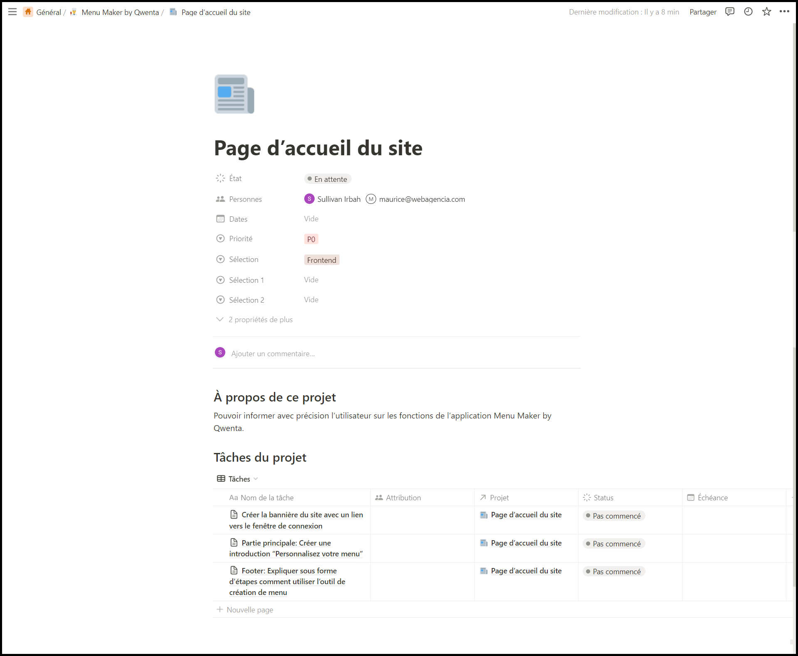
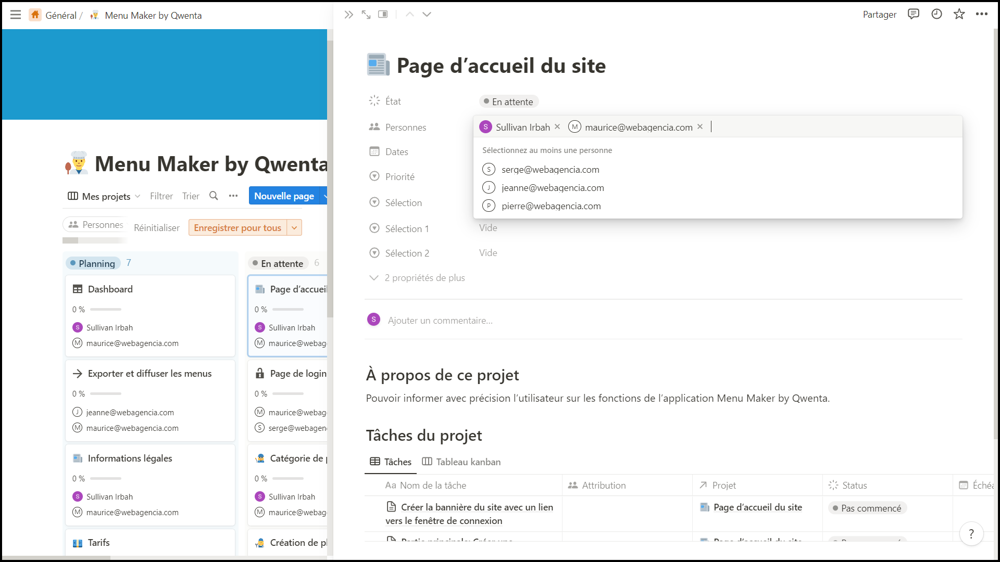
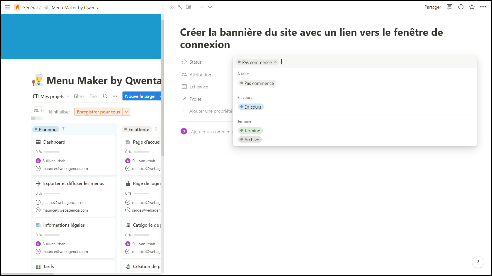

---
presentation:
  width: 1280
  height: 1024
  theme: serif.css
---

<!-- slide -->

# Menu Maker by Qwenta

# Projet 4

## Gestion de projet

<!-- slide -->

## Tableau Kanban

J'ai crée le tableau kanban sur le logiciel Notion.so, qui est très flexible, personnalisable et permet une collaboration en temps réel.

<!-- slide -->

**Le kanban est séparé en projets qui incluent differentes tâches:**

- Permet d'avoir une bonne vue d'ensemble, sans le surcharger.

- Chacunes des tâches reprend le scenario des user stories,  elles sont complémentaires pour obtenir le résultat voulu.

<!-- slide -->

Sur Notion, on a la possibilité d'inviter nos collaborateurs sur l'espace de travail, cela nous permettra de pouvoir ensuite les assigner à certaines tâches.

<!-- slide -->

Voici le contenu d'une carte lorsque l'on clique dessus.
Nous pouvons ajouter tous types d'infos sur le projet, les tâches à faire, une description sommaire et un commentaire.

<!-- slide -->

**On a la possibilité de modifier les paramètres de chaque cartes:**

L'état: Les projets sont "en attente" ou en "planning", cela dépend de la priorité dans laquelle nous effectuerons ces tâches.

<!-- slide -->

On pourra assigner nos collaborateurs chaque projet, correspondant à leurs capacités.

<!-- slide -->

J'ai inséré des mots-clés comme "Backend", "Frontend" et "Authentification" afin de mieux organiser les projets et l'équipe.

<!-- slide -->

On indique la priorité dans chaque projet, pour que l'équipe se concentre sur les tâches les plus importantes en premier.

- 3 priorités differentes:
  - P0, les tâches très urgentes
  - P1, les tâches importantes
  - P2, les tâches non prioritaires

<!-- slide -->

Pour chaque carte il y'a plusieurs tâches, sur lesquelles on va pouvoir appliquer un statut: "Pas commencé", "En cours", ou "Terminé".

<!-- slide -->

### Conclusion:

En planifiant un tableau kanban, nous pourrons déterminer les priorités, organiser les tâches et les répartir au sein de notre équipe.

Son utilisation permettra de mieux suivre l'avancement de chaque tâche, de respecter les délais et de mieux coordonner le travail en équipe.

<!-- slide -->

Outil de gestion de projet: https://turquoise-nape-903.notion.site/fd1f94b9d01b4cfdb7c834bc916a67c2?v=c22c9fceb84a4f8e886ce35392ec6843
