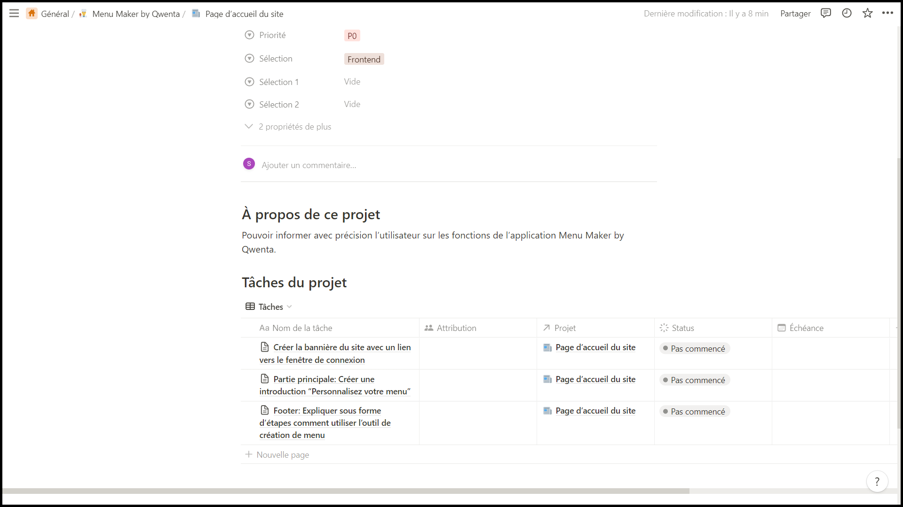
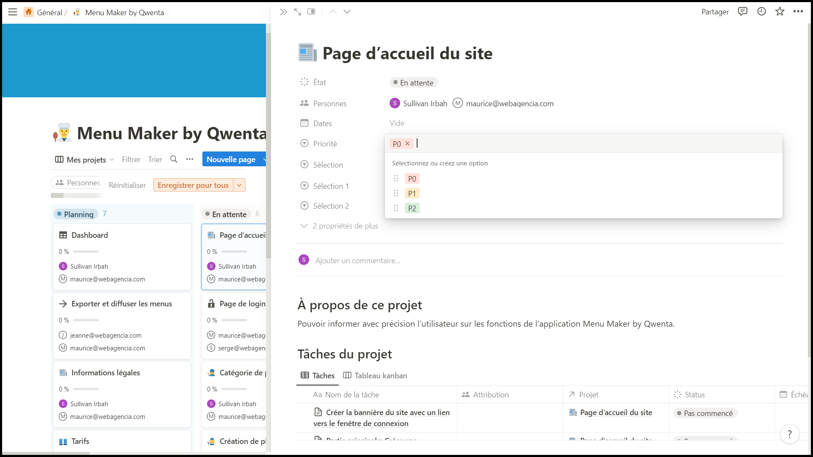

---
presentation:
  width: 1280
  height: 1024
  theme: black.css
---

<!-- slide -->

# Menu Maker by Qwenta

# Projet 4

## Gestion de projet

<!-- slide -->

## Tableau Kanban

Pour faire ce tableau kanban, j'ai choisi le logiciel Notion.
En effet c'est un outil très flexible et personnalisable, il permet aussi une collaboration en temps réel avec la possibilité de discuter et commenter les tâches en cours

<!-- slide -->

**Dans ce tableau, il y'a en tout et pour tout 14 projets:**

- Cela permet d'avoir une bonne vue d'ensemble de ce qu'il faut faire, sans avoir à surcharger le tableau.
- Il y'a donc plusieurs tâches assignée à un même projet, toutes ces tâches étant complémentaires pour obtenir le résultat voulu.

<!-- slide -->
  

Sur Notion, on a la possibilité d'inviter nos collaborateurs sur l'espace de travail, cela nous permettra de pouvoir ensuite les assigner à certaines tâches.

<!-- slide -->

Voici le contenu d'une carte lorsque l'on clique dessus.
Nous pouvons ajouter tous types d'infos sur le projet, les tâches à faire, une description sommaire et nous pouvons même commenter.

<!-- slide -->

**On a la possibilité de modifier les paramètres de chaque cartes:**

L'état: ici les projets sont soit "en attente" ou bien en "planning", cela dépend de la priorité dans laquelle nous effectuerons ces tâches.

<!-- slide -->

On pourra assigner nos collaborateurs sur chacun des projets, correspondant le plus à leurs capacités

<!-- slide -->

Dans la sélection, j'ai décidé de mettre les catégories tel que "Backend", "Frontend" ou bien "Authentification", cela permet de pouvoir assigner des collaborateurs qui pourront mener à bien cette tâche.

<!-- slide -->

On a la possibilité d'indiquer la priorité pour chaque projet, cela permettra à l'équipe de se concentrer sur les tâches les plus importantes en premier.

- Il y'a 3 priorités differentes:
- P0, les tâches très urgentes
- P1, les tâches importantes
- P2, les tâches non prioritaires

<!-- slide -->

Pour chaque carte il y'a plusieurs tâches, et sur chaque tâche on va pouvoir appliquer un statut, "Pas commencé", "En cours", ou "Terminé".

<!-- slide -->

### Conclusion:

En résumé, la planification et l'utilisation d'un outil de gestion de projet et d'un tableau Kanban sont des éléments clés pour la réussite d'un projet. Grâce à la mise en place de la planification, nous pourrons déterminer les priorités, organiser les tâches et les répartir efficacement au sein de notre équipe. L'utilisation de l'outil de gestion de projet et du tableau Kanban nous permettra de mieux suivre l'avancement de chaque tâche, de respecter les délais et de mieux coordonner le travail en équipe.

<!-- slide -->

Outil de gestion de projet: https://turquoise-nape-903.notion.site/fd1f94b9d01b4cfdb7c834bc916a67c2?v=c22c9fceb84a4f8e886ce35392ec6843
