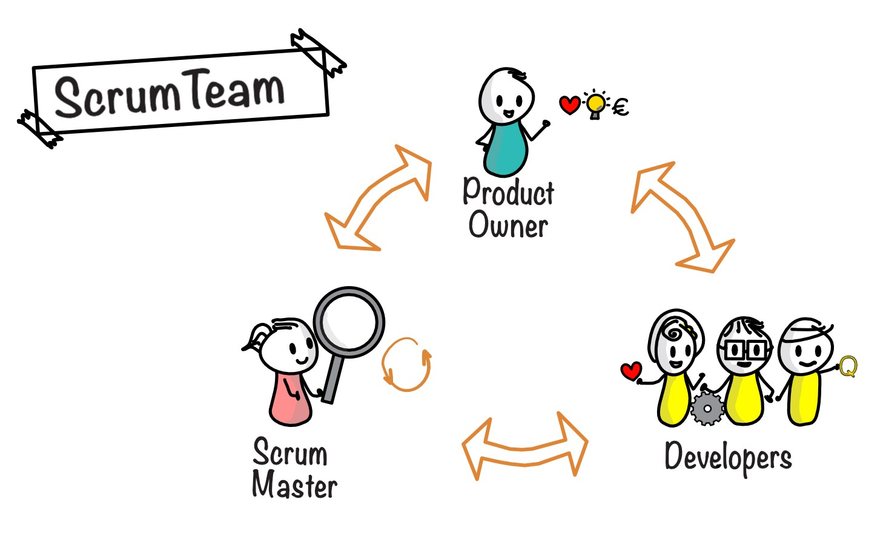
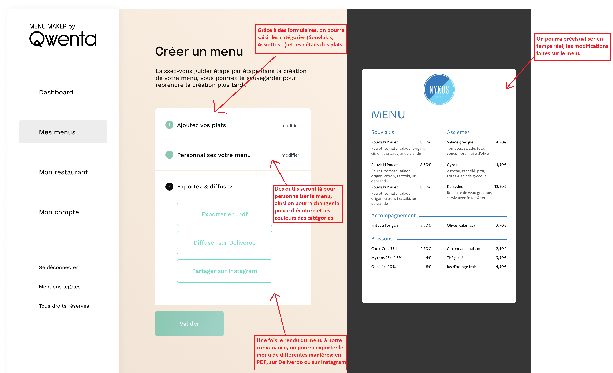

---
presentation:
  width: 1280
  height: 1024
  theme: serif.css
---

<!-- slide -->

# Menu Maker by Qwenta

# Projet 4

## Solution technique

<!-- slide -->

## **Présentation du support**

### I. Présentation de l'équipe de Webagencia

### II. Spécifications techniques du site

### III. Organisation

### IV. Conclusion

<!-- slide -->

## **I. Présentation de l'équipe de Webagencia**

<!-- slide -->

**Une Scrum Team est une équipe de personnes qui travaillent ensemble pour développer un produit ou un projet en utilisant la méthode agile.**

La Scrum Team de Webagencia pour mener à bien ce projet se compose de:

- Soufiane, le **Product Owner** (il est responsable de définir les objectifs du produit et de s'assurer que l'équipe de développement comprend les exigences du produit.)
- Clotilde, la **Scrum Master** (il facilite la mise en œuvre de la méthode agile et aide l'équipe à se concentrer sur les objectifs du sprint en cours.)
- **Une équipe de développeurs**:

  - 2 développeurs frontend: Sullivan et Maurice

  - 2 développeurs backend: Jeanne et Serge

<!-- slide -->

- **Qu'est ce que la methode agile ?**

  - La méthode agile est une méthodologie de gestion de projet.

  - Son but : améliorer leur process et réduire leur taux d’échec.
  - L'idée principale est de placer le client au cœur du projet et de s'adapter tout le long du fil du projet.

- **Les bienfaits de la méthode agile:**
  - Flexibilité (permet aux équipes de s'adapter rapidement aux changements de priorités et besoin)
  - Communication ameliorée entre les parties prenantes du projet.
  - Réduction des risques (en identifiant et en traitant rapidement les problèmes émergents)
  - Meilleur satisfaction du client (grâce à une communication étroite)

<!-- slide -->

## II. Spécifications techniques du site

### 1. Architecture système

<!-- slide -->

On pourrait segmenter un site internet en 3 catégories :

- Le frontend, c'est à dire la partie qui sera visible par l'utilisateur lorsqu'il sera sur le site.
- Le backend, c'est la partie "cachée", d'un site web, c'est ici que les données envoyées par l'utilisateur seront stockées, traitées, et gérées.
- Le serveur est un ordinateur qui a la possibilité de relier le frontend et le backend pour donner la possibilité d'avoir un site web complet et fonctionnel.

**Ainsi, il est important d'avoir des développeurs qui puissent être spécialisés dans le frontend, et le backend, car ce ne seront pas forcément les mêmes outils que l'on utilisera pour developper.**

<!-- slide -->

### 2. Fonctionnalités du site

La page d'accueil de Menu Maker, à partir d'ici on peut se connecter, acceder aux tarifs et aux aides pour créer le menu.

<!-- slide -->

Une fois connecté, on arrive sur le dashboard, ou l'on peut:

- Créer, imprimer et exporter son menu
- Avoir accés aux menus précedents
- Pouvoir modifier ses informations personnelles
- Acceder aux articles du blog

<!-- slide -->

    <figure>
        
        <figcaption>Menu formulaire</figcaption>
    </figure>
    <figure>
        
        <figcaption>Menu personnalisé</figcaption>
    </figure>
    <figure>
        
        <figcaption>Menu d'exportation</figcaption>
    </figure>

Faire un schéma ?

<!-- slide -->

### 3. Technologies à utiliser

### 4. Informations complémentaires

<!-- slide -->

## III. Organisation

### 1. Travail de veille

### 2. Tableau kanban

### 3. Communication entre Webagencia et Qwenta

<!-- slide -->

## IV. Conclusion
