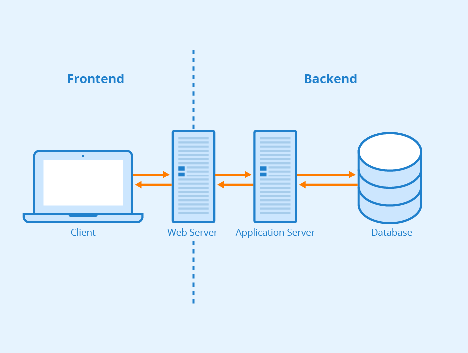
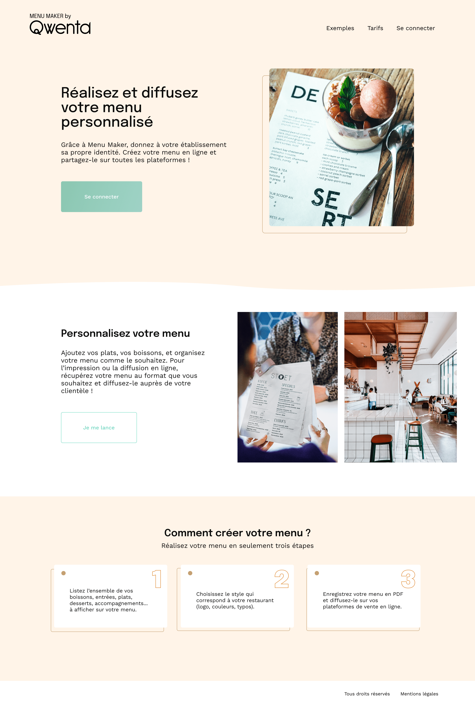
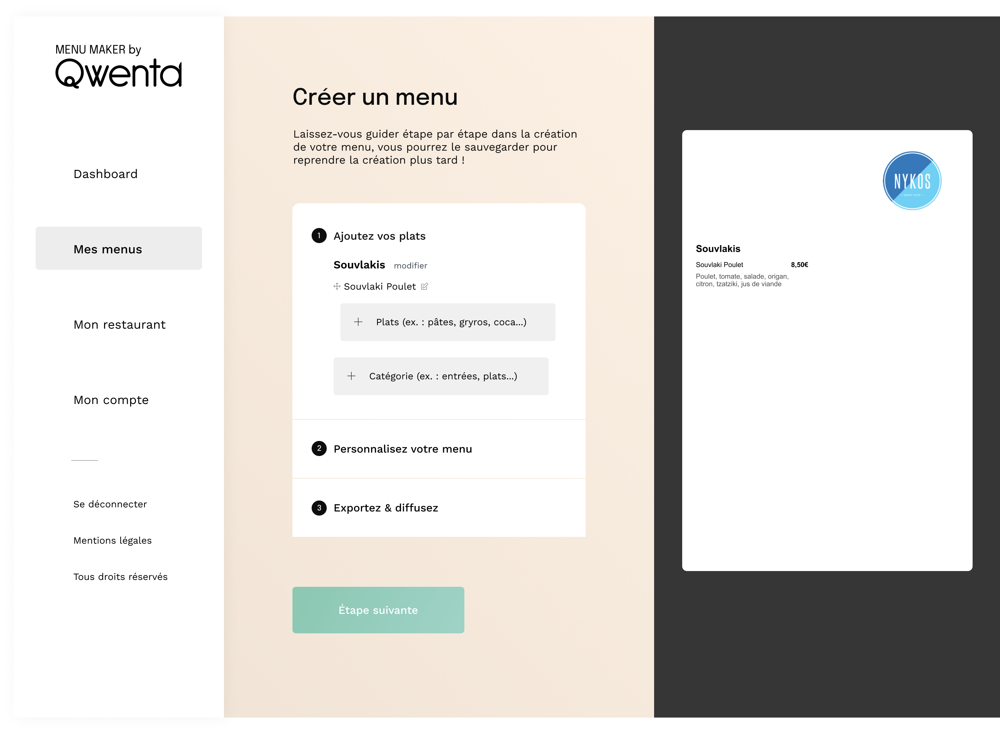
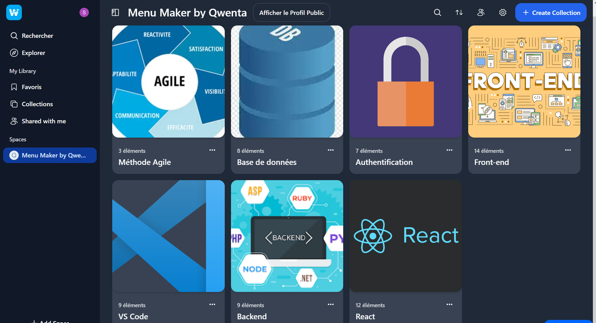
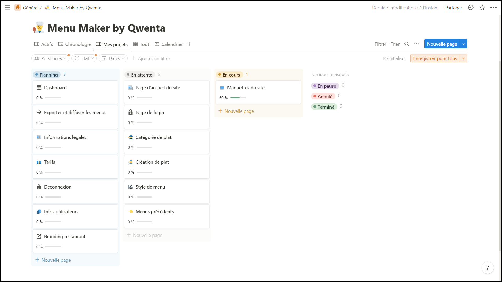

---
presentation:
  width: 1280
  height: 1024
  theme: serif.css
---

<!-- slide -->

# Menu Maker by Qwenta

# Projet 4

## Solution technique

<!-- slide -->

## **Présentation du support**

### I. Présentation de l'équipe de Webagencia

### II. Spécifications techniques du site

### III. Organisation

### IV. Conclusion

<!-- slide -->

## **I. Présentation de l'équipe de Webagencia**

<!-- slide -->

**Une Scrum Team est une équipe de personnes qui travaillent ensemble pour développer un produit ou un projet en utilisant la méthode agile.**

La Scrum Team de Webagencia pour mener à bien ce projet se compose de:

- Soufiane, le **Product Owner** (il est responsable de définir les objectifs du produit et de s'assurer que l'équipe de développement comprend les exigences du produit.)
- Clotilde, la **Scrum Master** (elle facilite la mise en œuvre de la méthode agile et aide l'équipe à se concentrer sur les objectifs du sprint en cours.)
- **Une équipe de développeurs**:

  - 2 développeurs frontend: Sullivan et Maurice

  - 2 développeurs backend: Jeanne et Serge

<!-- slide -->

- **Qu'est ce que la methode agile ?**

  - La méthode agile est une méthodologie de gestion de projet.

  - Son but : améliorer leur process et réduire leur taux d’échec.
  - L'idée principale est de placer le client au cœur du projet et de s'adapter tout le long du fil du projet.

- **Les bienfaits de la méthode agile:**
  - Flexibilité (permet aux équipes de s'adapter rapidement aux changements de priorités et besoin)
  - Communication ameliorée entre les parties prenantes du projet.
  - Réduction des risques (en identifiant et en traitant rapidement les problèmes émergents)
  - Meilleur satisfaction du client (grâce à une communication étroite)

<!-- slide -->

## II. Spécifications techniques du site

### 1. Architecture système

<!-- slide -->

On pourrait segmenter un site internet en 3 catégories :

- Le frontend, c'est à dire la partie qui sera visible par l'utilisateur lorsqu'il sera sur le site.
- Le backend, c'est la partie "cachée" d'un site web, où les données envoyées par l'utilisateur seront stockées, traitées, et gérées.
- Le serveur est un ordinateur qui a la possibilité de relier le frontend et le backend afin d'avoir un site web complet et fonctionnel.

**Il est important d'avoir des développeurs qui puissent être spécialisés dans le frontend ou le backend, car ce ne seront pas forcément les mêmes outils que l'on utilisera pour developper.**

<!-- slide -->

### 2. Fonctionnalités du site

Ce diagramme montre la façon dont nous avons structuré le site web. La page d'accueil est au sommet de l'arbre, chaque branche de l'arbre représente une page ou une section spécifique.

<!-- slide -->

La page d'accueil de Menu Maker, à partir d'ici on peut se connecter, acceder aux tarifs et aux aides pour créer le menu.

<!-- slide -->

Une fois connecté, on arrive sur le dashboard, ou l'on peut:

- Créer, imprimer et exporter son menu
- Avoir accés aux menus précedents
- Pouvoir modifier ses informations personnelles
- Acceder aux articles du blog

<!-- slide -->

Dans l'outil de création de menus:

1. Saisir les catégories (Souvlakis, assiettes...) et le détail des plats dans un formulaire
2. Changer la police d'écriture et la couleur des catégories
3. Exporter le menu de differentes manières: en pdf, sur deliveroo ou instagram

A droite, on pourra prévisualiser en temps réel les modifications.

<!-- slide -->

### 3. Technologies à utiliser

**_J'ai décidé de découper les technologies à utiliser en 3 étages:_**

---

**A. Interface utilisateur (frontend):**

- La combinaison HTML, CSS, JavaScript pour structurer, présenter et ajouter interactions et fonctionnalités à la page

- Des outils supplémentaires qui simplifient et accélèrent le processus de développement en fournissant des composants pré-construits:

  - **Bootstrap**, qui permet de créer facilement et rapidement des sites et applications web responsives.
  - **React**, pour créer des interfaces utilisateur interactives

<figure style="display: flex; flex-direction: row;align-items: center; gap: 10px;">
        
        <figcaption>Si on devait comparer à la construction d'une maison, HTML serait la charpente, CSS la peinture et JavaScript l'électricité, l'eau...</figcaption>
    </figure>

<!-- slide -->

**B. Logique de l'application (backend):**

- **Node.js** pour créer des applications web côté serveur (dont l'API REST) en JavaScript
- SQL pour stocker et récupérer des données à partir d'une base de données

**C. Outils supplémentaires:**

- Auth0, outil de gestion d'authentification pour sécuriser l'accès à l'application web
- API RESTful, permet la communication entre différents systèmes
- Nodemailer, pour envoyer des emails à partir de l'application web
- API **Instagram** et **Deliveroo** pour permettre de diffuser son menu sur ces sites.
- jsPDF, génere des fichiers PDF à partir de contenu HTML.

<!-- slide -->

### 4. Informations complémentaires

**• GENERAL :**

- Nom du domaine : menumaker.qwenta.com
- Nom de l’hébergement : OVH
- Adresse e-mail : contact@menumaker.com
- Le site doit être compatible avec les 2 dernières versions des navigateurs maintenus (Firefox, Safari et Chrome).
- Le site sera en version desktop.

**• SECURITE :**

- Mettre en œuvre les protocole TLS et HTTPS (pour sécuriser les échanges entre le serveur et l'utilisateur)
- Limiter l’acces aux outils et interfaces d’administration aux seules personnes habilitées
- Stocker les informations de connexion dans un endroit sur
- Ne pas placer les bases de données sur un serveur directement accessible depuis Internet.

<!-- slide -->

**• MAINTENANCE :**

**Il existe deux grands types de maintenance de site :**

- **L’entretien technique:** mises à jour de sécurité, d’extensions, de scripts, de performances…
- **La gestion du contenu:** mises à jour des contenus obsolètes, liens cassés, pages inutiles…

**• FUTURES MISES A JOUR :**

- **Page d’accueil** : Ajouter des animations sur la photo de la bannière + sur les formes géométriques des sections.
- **Tarifs** : Les intégrer directement sur Menu Maker
- **Paiement** : Créer le possibilité de changer de moyen de paiement
- **Blog** : Créer un blog interne à Menu Maker

<!-- slide -->

## III. Organisation

### 1. Travail de veille

Le travail de veille permet de sélectionner les outils les plus adaptés aux besoins et tendances actuelles, pour garantir le succès du projet.

<!-- slide -->

### 2. Tableau kanban

- Un tableau Kanban est un outil de gestion de projet visuel qui documente le flux de travail sous forme de cartes.

- L'utilisation d'un tableau Kanban dans le cadre de la méthode agile permet d'optimiser la communication, la flexibilité et la productivité de l'équipe de développement.

<!-- slide -->

### 3. Communication entre Webagencia et Qwenta

Ce processus agile sera utilisé par l'équipe durant la conception du site.

- Pendant le sprint, l'équipe travaillera sur les fonctions jugées prioritaires lors du planning meeting.
- A la fin de chaque sprint, Webagencia et Qwenta rentreront en communication.

**L'objectif est d'assurer la transparence entre les parties prenantes.**

<!-- slide -->

- Le planning prévisionnel sera mis à jour après chaque communication entre les 2 parties.
- La communication aura lieu:
  - entre le chef de projet de Qwenta et notre Scrum Master.
  - en visioconférence via l'outil slack.
  - toutes les 2 semaines

<!-- slide -->

## IV. Conclusion

- Grâce à notre approche agile, nous avons développé une méthode claire de travail, permettant une adaptation rapide aux situations.

- La communication régulière entre Webagencia et Qwenta garantira la transparence tout au long du projet.

- Suite au travail de veille, nous avons sélectionné les technologies les plus adaptées pour le projet.

- Notre approche agile nous permettra donc de livrer un site Web de haute qualité qui répondra aux besoins de Qwenta.
