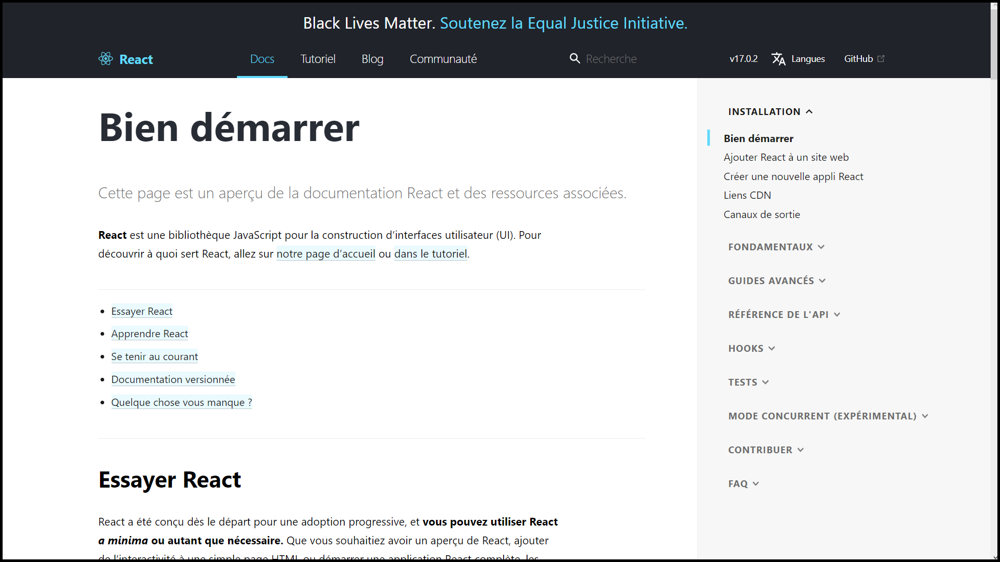

---
presentation:
  width: 1280
  height: 1024
  theme: serif.css
---

<!-- slide -->

# Menu Maker by Qwenta

# Projet 4

## Outil de veille

<!-- slide -->

## **Présentation du support**

### I. Aperçu de l'outil Wakelet

### II. Séléction du contenu

### III. Intégration des informations dans l'outil

### IV. Conclusion

### V. Annexe

<!-- slide -->

## I. **Aperçu de l'outil Wakelet**

  

- Wakelet est une plateforme gratuite pour stocker, organiser et partager du contenu en ligne.

- Le contenu de la veille est disposé dans 6 collections differentes dans un espace commun appelé "Menu Maker by Qwenta".

<!-- slide -->

### Les points forts de Wakelet:

- Sauvegarder facilement les contenus trouvés sur Internet

- Pouvoir partager ses collections avec un lien sur des outils de collaboration type Slack ou Microsoft Teams
- Pouvoir organiser la disposition de son contenu

**C'est donc un outil très efficace dans le cadre d'une veille technologique.**

<!-- slide -->

## **II. Séléction du contenu**

### **1. Le plugin daily.dev:**

- Daily.dev est une plateforme permettant de retrouver toutes les actualités, articles et ressources sur le développement web, provenant de plus de 400 sources dans un seul flux.

- Il est disponible sur Chrome, Firefox et Edge.

<!-- slide -->

**On peut personnaliser son flux selon:**

- Les thèmes (cloud, databases, tech news, web development)

- Des mots clés plus précis (image ci dessus)

Daily.dev est un excellent outil pour les développeurs qui souhaitent rester au courant des dernières tendances et innovations.

<!-- slide -->

### **2. Google Alert**

Google Alert est un outil de surveillance en ligne qui permet de suivre des mots clés spécifiques et de recevoir des mises à jour régulières.

<!-- slide -->

### Plusieurs options de configurations:

- Le type de résultat souhaité: actualités, blogs, vidéos, etc...
- La langue souhaitée
- La fréquence à laquelle on veut recevoir les alertes: journalière, hebdomadaire, mensuelle...
- Le mode d'obtention des mises à jour: par e-mail, via un flux RSS.

**Sa personnalisation et sa praticité en fait un outil très efficace dans le cadre d'une veille technologique.**

<!-- slide -->

### **3. La documentation officielle**

La documentation officielle, ce sont les outils mis à dispoisition par les créateurs des technologies (ici React) afin de pouvoir aiguiller les débutants ou bien informer les développeurs confirmés des nouveautés.

<!-- slide -->

### Les points forts de la documentation officielle:

- Complète, elle couvre aussi bien les fonctionnalités de base que les fonctionnalités approfondies.

- Mise à jour régulièrement, elle ne sera donc jamais obsolète
- Organisée de manière logique, elle permet aux développeurs de trouver rapidement l'information dont ils ont besoin.

<!-- slide -->

## **III. Intégration des informations dans l'outil**

Une fois les informations utiles trouvées dans le cadre de la veille, il est possible de les ajouter à une collection grâce à un lien. On peut également inclure du texte, des images ou des fichiers PDF pour enrichir la veille.

<!-- slide -->

La carte ainsi créee, on peut la modifier et gérer sa disposition afin de classer les liens dans plusieurs sous-thèmes (documentation, actualités, vidéos...)

<!-- slide -->

On peut ajouter une image, un titre et des commentaires destinés aux collaborateurs via l'outil de modification de la carte.

<!-- slide -->

## **IV. Conclusion**

- Les outils de veille présentés sont des moyens efficaces pour surveiller et collecter les informations nécessaires afin de prendre des décisions:

  - En organisant et en classant les informations collectées, nous pourrons collaborer de manière plus efficace et diffuser des informations pertinentes aux parties prenantes.

  - Les informations collectées à partir de la veille seront utiles pour savoir quels sont les outils les plus adaptés au projet.

<!-- slide -->

## **V. Annexe**

Espace Wakelet: https://wakelet.com/i/invite?isSpace=true&code=2xbimxxo
